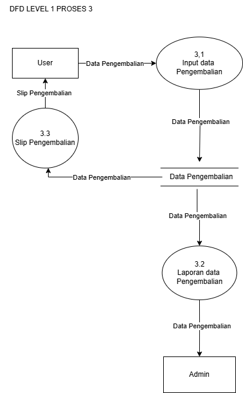

[ENGLISH](README_EN.md)


# APLIKASI PEMINJAMAN BUKU DIGITAL BOJONEGORO (PusDigital)

Aplikasi desktop perpustakaan digital untuk mengelola peminjaman dan pengembalian buku.  
Dibangun dengan **Java Swing (NetBeans)** + **MySQL/MariaDB** via **JDBC**.

> Proyek UKK — SMK Negeri 4 Bojonegoro | RPL | 2026

---

## Tech Stack

| Layer | Teknologi |
|-------|-----------|
| Frontend | Java Swing (NetBeans GUI Builder) |
| Backend | Java SE (JDK 1.8+) |
| Database | MariaDB 10.4 / MySQL (phpMyAdmin) |
| Koneksi DB | JDBC |
| Report/Struk | JasperReports (.jrxml → .jasper) |
| Deployment | Offline — 2 monitor + 1 PC, menggunakan MouseMux |

---

## Fitur

### Admin
- Dashboard dengan statistik (total user, buku, kategori, peminjaman aktif/selesai)
- CRUD & filter: Data User, Kategori, Buku, Buku Item, Transaksi
- Kelola peminjaman (approve/tolak/perpanjang/selesaikan)
- Cetak struk/invoice denda (JasperReports)
- Riwayat transaksi peminjaman & pengembalian

### User
- Registrasi & login (NIK/NIP/NISN + password)
- Lihat katalog buku (search by judul, filter by kategori)
- Ajukan peminjaman buku (maks. 3 buku per transaksi)
- Lihat status peminjaman aktif

---

## Batasan Masalah

- Aplikasi hanya bisa digunakan **offline**
- User maksimal meminjam **3 buku** per transaksi
- Batas waktu pengembalian: **7 hari** atau **1 hari**
- Denda keterlambatan: **Rp1.000/hari**
- Perpanjangan peminjaman maksimal **5 hari tambahan**
- Implementasi menggunakan **2 monitor + 1 PC** dengan MouseMux
- Cetak struk/invoice untuk denda

---

## Database

Database `perpusdigital` terdiri dari **6 tabel**:

```
perpusdigital
├── user              # Data user (admin/siswa/guru/pengunjung)
├── kategori          # Kategori buku
├── buku              # Data bibliografis (judul, penulis, penerbit, dll)
├── buku_item         # Eksemplar fisik buku (kode buku, status)
├── peminjaman        # Transaksi peminjaman aktif
└── riwayat_peminjaman # Arsip transaksi yang sudah selesai
```

SQL dump tersedia di: [`perpusdigital.sql`](perpusdigital.sql)

---

## Struktur Project

```
src/
├── koneksi/
│   └── koneksi.java            # Koneksi JDBC ke MariaDB
├── pusdigg/
│   ├── login.java              # Form login
│   ├── registrasi.java         # Form registrasi
│   ├── session.java            # Session management
│   ├── dashboard_admin.java    # Dashboard admin
│   ├── sidebar_admin.java      # Sidebar navigasi admin
│   ├── user.java               # CRUD data user
│   ├── kategori.java           # CRUD data kategori
│   ├── daftar_kategori.java    # List kategori
│   ├── buku.java               # CRUD data buku
│   ├── itembuku.java           # CRUD data buku item
│   ├── transaksi_admin.java    # Kelola transaksi (admin)
│   ├── transaksi_peminjaman_user.java  # Peminjaman (user)
│   ├── U_peminjaman.java       # Detail peminjaman user
│   └── riwayat_transaksi_admin.java    # Riwayat transaksi
└── slip/
    ├── struk.jrxml             # Template struk JasperReports
    └── struk.jasper            # Compiled report
```

---

## Diagram Alur Sistem

Semua diagram tersedia di folder [`img/`](img/).

### ERD (Entity Relationship Diagram)


Relasi antar tabel:
- **User → Kategori**: Satu admin bisa mengelola banyak kategori (`created_by`, `update_by`)
- **Kategori → Buku**: Satu kategori memiliki banyak buku (`kategori_id` FK)
- **Buku → Buku Item**: Satu judul buku memiliki banyak eksemplar fisik (`buku_id` FK). Buku = data bibliografis, Buku Item = inventaris per eksemplar (kode buku, status: tersedia/dipinjam/rusak/hilang)
- **User → Peminjaman**: Satu user bisa memiliki banyak peminjaman (`user_id` FK)
- **Peminjaman → Riwayat Peminjaman**: Peminjaman yang selesai diarsipkan ke riwayat

### DFD Level 0


Gambaran besar sistem — 3 proses utama:
1. **Proses Pendataan** — Admin mengelola master data (user & buku)
2. **Proses Peminjaman** — User meminjam buku, admin menerima laporan
3. **Proses Pengembalian** — User mengembalikan buku, admin menerima laporan

### DFD Level 1

**Proses 1 — Pendataan** (termasuk di DFD Level 0 image)
- Pendataan User → Cek Kelengkapan → Simpan ke DB → Tampilkan
- Pendataan Buku → Cek Kelengkapan → Simpan ke DB → Tampilkan

**Proses 2 — Peminjaman**

- Data Buku mengalir dari datastore → Memilih Buku → Input Data Peminjaman → simpan ke datastore Peminjaman
- Data Peminjaman mengalir ke Laporan (→ Admin) dan Slip Peminjaman (→ User)

**Proses 3 — Pengembalian**

- Data Pengembalian dari User → Input → simpan ke datastore Pengembalian
- Data mengalir ke Laporan (→ Admin) dan Slip Pengembalian (→ User)

### DFD Level 2


Detail operasi CRUD untuk: Control User, Control Buku, Data Peminjaman, Data Pengembalian.

### Flow of System (FOS)


Alur sistem keseluruhan dari Mulai → Registrasi → Login → Cek Role → Admin/User menu → Logout.

### Flowchart


Alur proses lengkap termasuk decision logic (cek stok, cek keterlambatan, cek perpanjangan).

---

## Setup & Run

### Prerequisites
- JDK 1.8+
- NetBeans IDE
- XAMPP / MariaDB 10.4+
- MouseMux (untuk setup 2 monitor)

### Langkah
1. Import `perpusdigital.sql` ke phpMyAdmin
2. Buka project di NetBeans
3. Pastikan JDBC driver (mysql-connector) ada di Libraries
4. Sesuaikan koneksi di `koneksi.java` (host, port, user, password)
5. Run project

### Default Login
| Role | Nomor | Password |
|------|-------|----------|
| Admin | 12345678 | admin |
| User | 12345678 | user |

---

## Author

**Anonsec With Kelompok 8**  
SMK Negeri 4 Bojonegoro — XII RPL 1

GitHub: [@0xnhsec](https://github.com/0xnhsec)

---

## License

Project ini dibuat untuk keperluan **Ujian Kompetensi Keahlian (UKK) 2026**.
