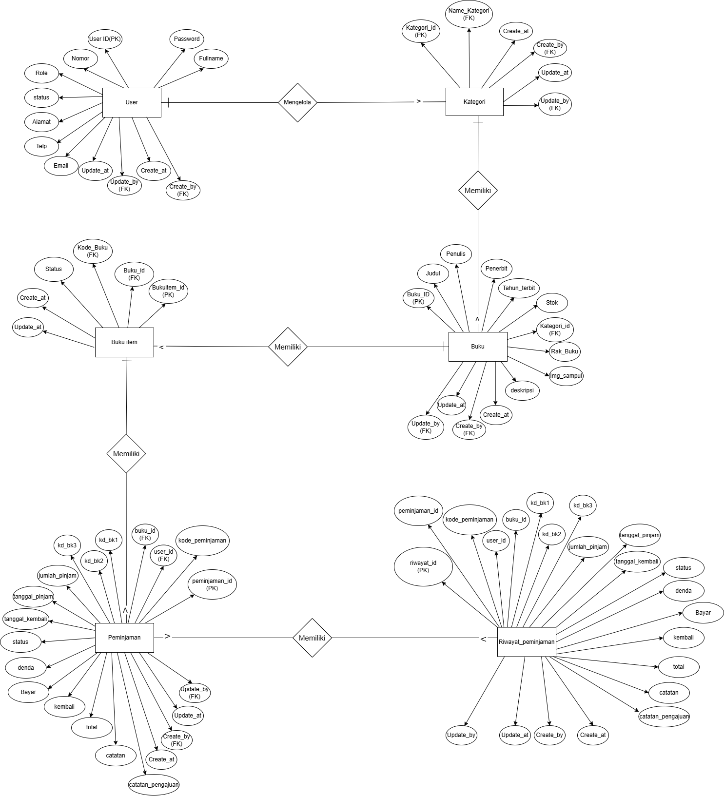
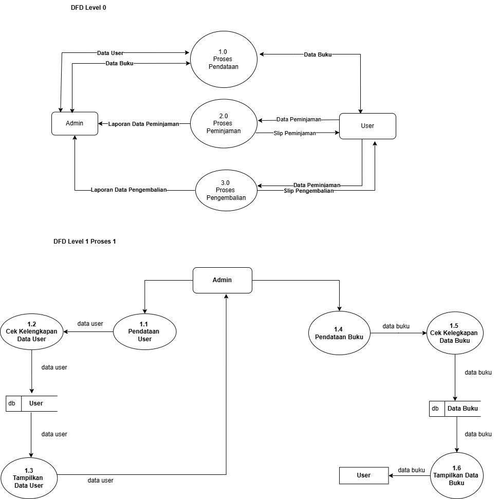
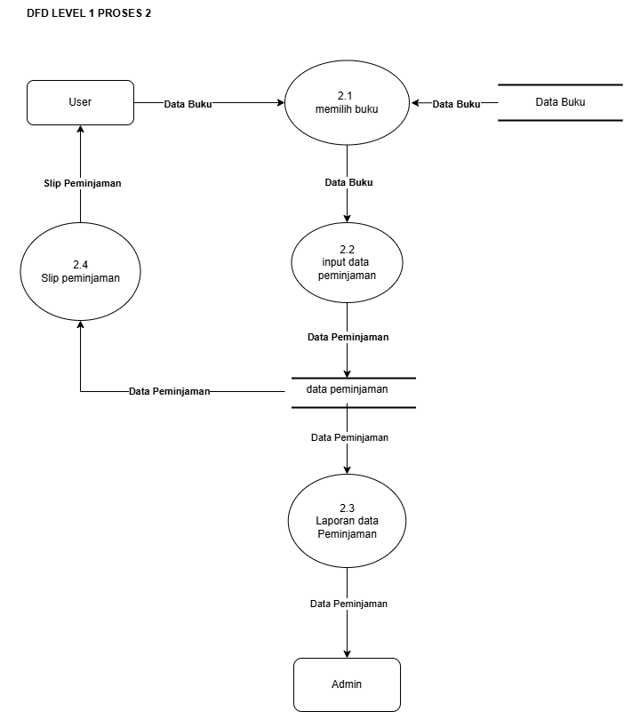
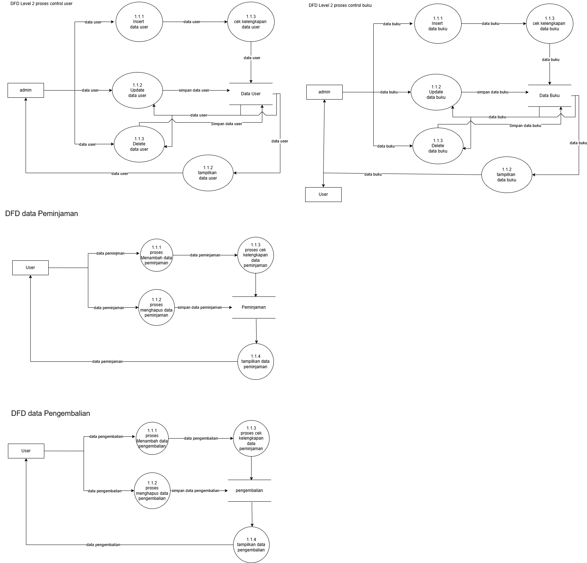
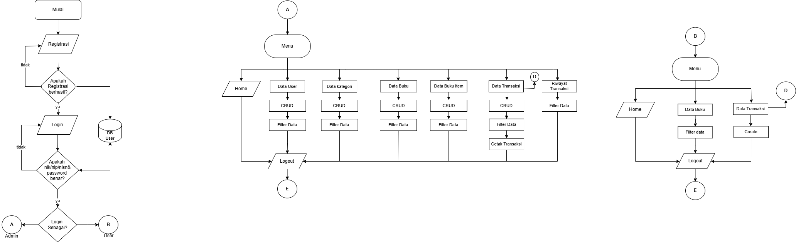
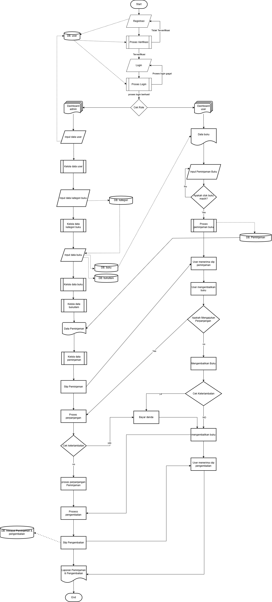

[INDONESIAN](README.md)


# APLIKASI PEMINJAMAN BUKU DIGITAL BOJONEGORO (PusDigital)

A desktop digital library management system for book lending and returning.  
Built with **Java Swing (NetBeans)** + **MySQL/MariaDB** via **JDBC**.

> Final Exam Project (UKK) — SMK Negeri 4 Bojonegoro | Software Engineering | 2026

---

## Tech Stack

| Layer | Technology |
|-------|-----------|
| Frontend | Java Swing (NetBeans GUI Builder) |
| Backend | Java SE (JDK 1.8+) |
| Database | MariaDB 10.4 / MySQL (phpMyAdmin) |
| DB Connection | JDBC |
| Report/Receipt | JasperReports (.jrxml → .jasper) |
| Deployment | Offline — 2 monitors + 1 PC, using MouseMux |

---

## Features

### Admin
- Dashboard with statistics (total users, books, categories, active/completed loans)
- CRUD & filter: User Data, Categories, Books, Book Items, Transactions
- Manage loans (approve/reject/extend/complete)
- Print fine receipts/invoices (JasperReports)
- Loan & return transaction history

### User
- Registration & login (ID number + password)
- Browse book catalog (search by title, filter by category)
- Submit book loan requests (max 3 books per transaction)
- View active loan status

---

## Constraints

- Application runs **offline only**
- Maximum **3 books** per loan transaction
- Return deadline: **7 days** or **1 day**
- Late fee: **Rp1,000/day** (default)
- Loan extension up to **5 additional days**
- Deployed on **2 monitors + 1 PC** using MouseMux
- Receipt/invoice printing for fines

---

## Database

The `perpusdigital` database consists of **6 tables**:

```
perpusdigital
├── user                # User data (admin/student/teacher/visitor)
├── kategori            # Book categories
├── buku                # Bibliographic data (title, author, publisher, etc.)
├── buku_item           # Physical book copies (book code, status)
├── peminjaman          # Active loan transactions
└── riwayat_peminjaman  # Archived completed transactions
```

SQL dump available at: [`perpusdigital.sql`](perpusdigital.sql)

---

## Project Structure

```
src/
├── koneksi/
│   └── koneksi.java            # JDBC connection to MariaDB
├── pusdigg/
│   ├── login.java              # Login form
│   ├── registrasi.java         # Registration form
│   ├── session.java            # Session management
│   ├── dashboard_admin.java    # Admin dashboard
│   ├── sidebar_admin.java      # Admin sidebar navigation
│   ├── user.java               # User data CRUD
│   ├── kategori.java           # Category CRUD
│   ├── daftar_kategori.java    # Category list
│   ├── buku.java               # Book data CRUD
│   ├── itembuku.java           # Book item CRUD
│   ├── transaksi_admin.java    # Transaction management (admin)
│   ├── transaksi_peminjaman_user.java  # Loan request (user)
│   ├── U_peminjaman.java       # User loan details
│   └── riwayat_transaksi_admin.java    # Transaction history
└── slip/
    ├── struk.jrxml             # JasperReports receipt template
    └── struk.jasper            # Compiled report
```

---

## System Diagrams

All diagrams are available in the [`img/`](img/) folder.

### ERD (Entity Relationship Diagram)


Table relationships:
- **User → Kategori**: One admin can manage many categories (`created_by`, `update_by` FK)
- **Kategori → Buku**: One category contains many books (`kategori_id` FK)
- **Buku → Buku Item**: One book title has many physical copies (`buku_id` FK). Buku = bibliographic data, Buku Item = per-copy inventory (book code, status: available/borrowed/damaged/lost)
- **User → Peminjaman**: One user can have many loans (`user_id` FK)
- **Peminjaman → Riwayat Peminjaman**: Completed loans are archived to history

### DFD Level 0


High-level system overview — 3 main processes:
1. **Data Management** — Admin manages master data (users & books)
2. **Loan Process** — User borrows books, admin receives reports
3. **Return Process** — User returns books, admin receives reports

### DFD Level 1

**Process 1 — Data Management** (included in DFD Level 0 image)
- User data entry → Validation → Save to DB → Display
- Book data entry → Validation → Save to DB → Display

**Process 2 — Loan**

- Book data flows from datastore → Book Selection → Loan Data Input → saved to Loan datastore
- Loan data flows to Report (→ Admin) and Loan Slip (→ User)

**Process 3 — Return**

- Return data from User → Input → saved to Return datastore
- Data flows to Report (→ Admin) and Return Slip (→ User)

### DFD Level 2


Detailed CRUD operations for: User Control, Book Control, Loan Data, Return Data.

### Flow of System (FOS)


Complete system flow from Start → Registration → Login → Role Check → Admin/User menu → Logout.

### Flowchart


Full process flow including decision logic (stock check, late check, extension check).

---

## Setup & Run

### Prerequisites
- JDK 1.8+
- NetBeans IDE
- XAMPP / MariaDB 10.4+
- MouseMux (for 2-monitor setup)

### Steps
1. Import `perpusdigital.sql` into phpMyAdmin
2. Open the project in NetBeans
3. Make sure the JDBC driver (mysql-connector) is in Libraries
4. Adjust the connection settings in `koneksi.java` (host, port, user, password)
5. Run the project

### Default Login
| Role | ID Number | Password |
|------|-----------|----------|
| Admin | 12345678 | admin |
| User | 12345678 | user |

---

## Author

**Anonsec with Team 8**  
SMK Negeri 4 Bojonegoro — XII RPL 1

GitHub: [@0xnhsec](https://github.com/0xnhsec)

---

## License

This project was created for the **Vocational Competency Exam (UKK) 2026**.
